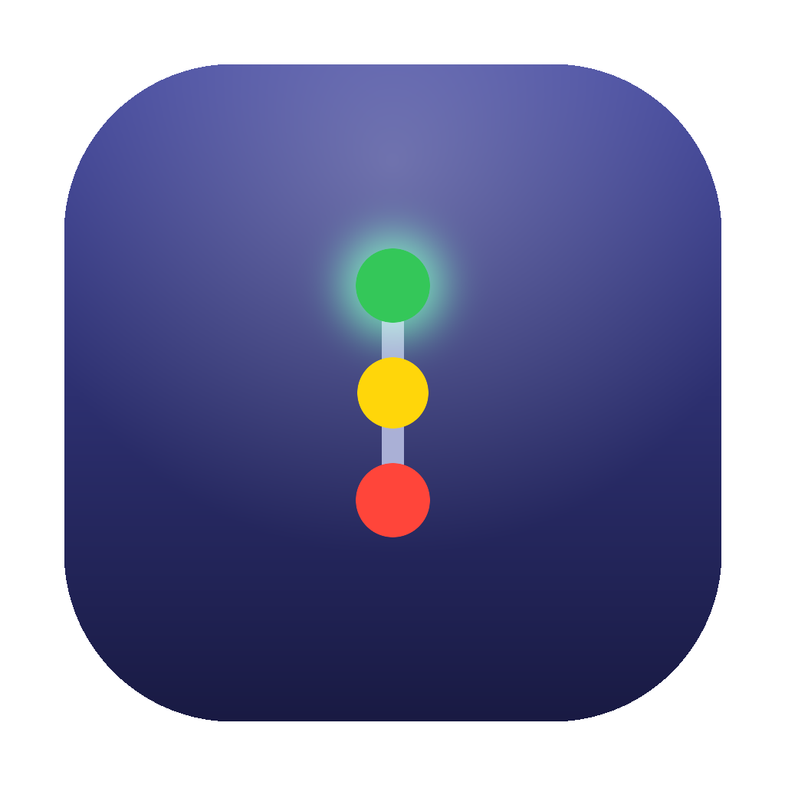
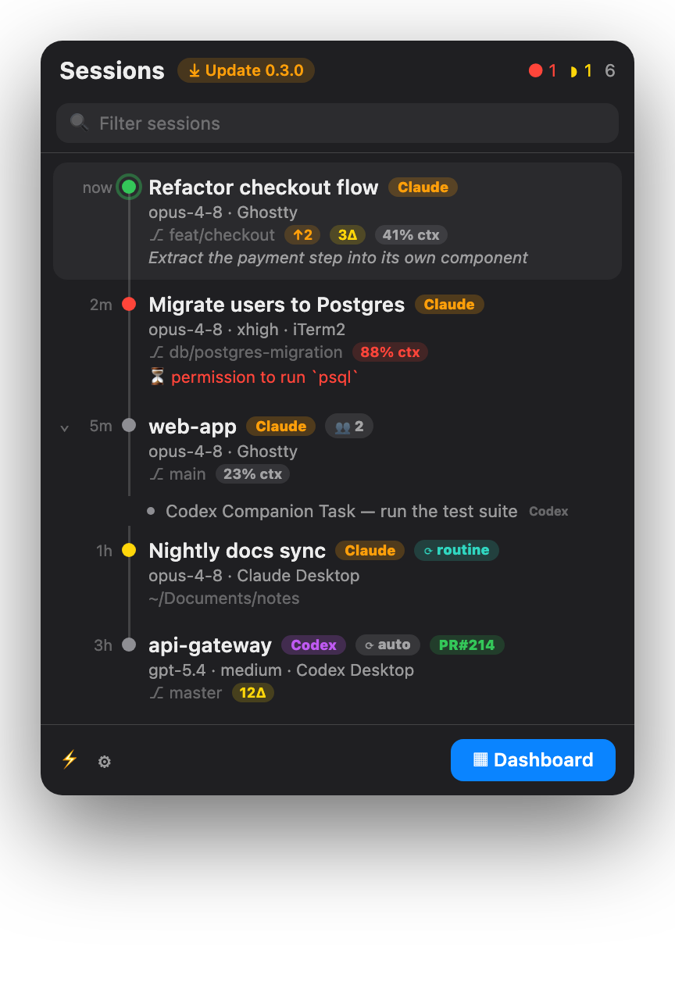
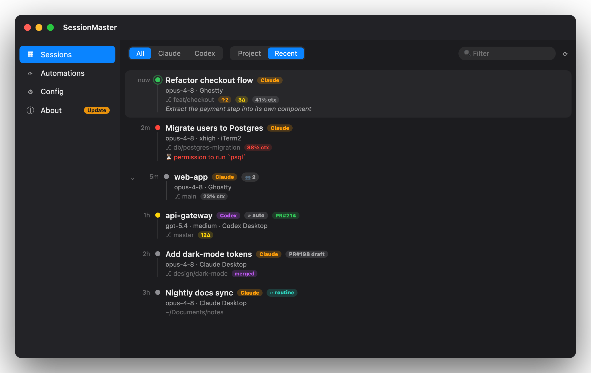

<p align="center">
  
</p>

# SessionMaster

<p align="center">
  <a href="https://github.com/wushan/session-master/releases/latest"></a>
  
  
  
</p>

**One live menu-bar console for every AI coding session on your Mac** — Claude Code and
Codex, across CLI **and** desktop apps. Stop juggling a dozen terminal and app windows:
see every session, know which one needs you, and jump straight to it.

<p align="center">
  <br>
  <sub>The menu-bar popover — every Claude &amp; Codex session, what each one needs, one click to jump back.</sub>
</p>

<p align="center">
  <b>Install</b> &nbsp;·&nbsp; <code>brew install --cask wushan/tap/session-master</code>
  &nbsp;·&nbsp; <a href="https://github.com/wushan/session-master/releases/latest">or grab the .dmg →</a>
</p>

## Why

If you run several Claude Code / Codex sessions at once — across terminals, the Claude
desktop app, the Codex desktop app, and VS Code — you lose track of:

- which session belongs to which **project / worktree / branch**
- what **model / effort** each is on
- which one is **waiting for you** vs. still working
- *where the actual window is* when you want to get back to it

SessionMaster reads the session state every couple of seconds (all local, read-only) and
puts it in one place, with one-click recall.

## Features

- **Unified, real-time list** of Claude Code (CLI + Desktop) and Codex (CLI + Desktop + VS
  Code) sessions — both *live* and your *saved* Desktop conversations, grouped by project
  (recent first, the rest one click away). The source badge's glyph tells the surface apart at
  a glance: a **filled terminal** (live terminal attached), an outline terminal (closed CLI
  session), or a **macwindow** (Desktop app conversation); an **app→cli** chip marks a Desktop
  conversation that a terminal has taken over. Codex terminal sessions are matched to their
  actual `codex` process, so an open TUI is recallable even after hours idle, and closed
  threads show as resumable for a full day.
- **Status that tells you what each session needs** — your turn, needs approval, working, idle
  — with **sound + Notification Center alerts** when a session finishes its turn or hits a
  permission prompt.
- **Rich at-a-glance status on each row**: git branch state (merged / ↑unpushed / ↓behind /
  local), uncommitted change count, **clickable PR badge** (open / draft / merged), context-
  window %, and the session's last prompt.
- **Timeline list in attention tiers** — *Needs you / Working / Idle* sections with a collapsed
  **Saved & ended shelf**, so dozens of saved conversations never bury the rows that matter.
  Last-activity time sits on a left axis; a **halo ring** marks sessions that are actively
  working; rows that need you carry a **colored edge bar**; sessions idle >48h fade to grayscale
  (unless they still need you). Repeated routine runs collapse into one row with an **×N runs**
  chip.
- **Rename** any session to a memorable title (✏️, click to edit) and **quick-filter** the list —
  search also reaches back to find (and resume) a session you closed days ago.
- **Parent → child hierarchy**: a Claude session nests the things it spawned — Codex companions,
  its currently-running Task **sub-agents**, and any in-progress dynamic **workflow** run —
  **collapsed by default** with a count, shown as compact read-only lines when expanded (children
  can't be recalled or acted on). Finished sub-agents and completed workflows drop off.
- **One-click Recall** (click the row): focuses the exact terminal window that owns a session, on
  whichever monitor it's on. If it's on another virtual desktop (Space), modern macOS blocks every
  programmatic Space switch, so SessionMaster fans that terminal's windows out with **App Exposé** —
  click the one you want and macOS switches to its desktop natively. Codex Desktop sessions recall
  via the `codex://threads/<id>` deep link straight to the conversation.
- **Resume a closed session** (click the row, or its blue **resume** chip): when a CLI session's
  terminal is gone — or it's a saved Desktop / Codex thread — SessionMaster reopens it in a fresh
  terminal running the tool's own resume command (`claude --resume <id>` / `codex resume <id>`) in
  the session's folder. Pick which terminal it opens in — **System default / Terminal / iTerm2 /
  Ghostty** — under *Config ▸ Terminal*.
- **Open in your editor / Reveal in Finder** — pointed at the session's *real worktree*, not
  the repo root. Editor is configurable (VS Code / Cursor / Zed / Sublime / Xcode / custom).
- **Routines & Automations** tab: Claude scheduled tasks + Codex automations, with next run.
- **Dashboard** with Project / Recent sort, source filter (All / Claude / Codex / **CLI** — the
  last one mutes the Desktop archive), and search; the **menu-bar popover triages by default**
  (needs-you + working only, "Show all" one click away); **Config** and **About**
  (version + one-click *Update via Homebrew*) tabs. Open it and a Dock icon appears so you can
  minimize it like any window; close it and the app drops back to menu-bar only. It **stays
  always on top** by default so the session list is visible behind your work — toggle that off in
  Config.
- **Launch at login**, menu-bar only — with a **configurable menu-bar icon**.

<p align="center">
  <br>
  <sub>The dashboard — top tabs, a collapsible source filter, a Sort menu, search, and a rich row per session.</sub>
</p>

### Status colors

| Dot | Meaning |
|----|----|
| 🔴 red | needs your **approval** (a permission prompt is waiting) |
| 🟡 yellow | **your turn** — the assistant finished and is waiting for your input |
| 🟢 green | **working** |
| ⚪ gray | idle / background |

A session whose terminal has closed shows a blue **resume** chip instead of a live dot — click it (or the row) to reopen the session in a terminal. The menu-bar icon shows the count of sessions that need you.

## Install

Requires **macOS 14+**.

### Homebrew (easiest)

```sh
brew install --cask wushan/tap/session-master
```

### Download the .dmg

Grab the latest `.dmg` from [Releases](https://github.com/wushan/session-master/releases) and
drag **SessionMaster** to Applications. The app is **self-signed (not notarized)**, so clear
the download quarantine once (the Homebrew cask does this for you):

```sh
xattr -dr com.apple.quarantine /Applications/SessionMaster.app
```

### From source

Requires a **Swift 5.9+ / Xcode 15+** toolchain.

```sh
git clone https://github.com/wushan/session-master.git
cd session-master
scripts/install.sh    # build release, sign, install to /Applications
```

`scripts/install.sh` creates a small self-signed identity in a dedicated keychain
(`scripts/make-dev-cert.sh`) so the Accessibility grant persists across rebuilds — local-only,
not sensitive.

### First launch

Click the ▦ menu-bar icon → **Dashboard**, and grant **Accessibility** when prompted
(System Settings ▸ Privacy & Security ▸ Accessibility). Recall needs it to focus and move
terminal windows — the in-app banner links you straight there.

### Develop

```bash
scripts/bundle-app.sh       # debug build → build/SessionMaster.app
open build/SessionMaster.app

# Drive the engine (SessionCore) without the GUI:
swift run recall-probe list   # live Claude sessions + owning terminal
swift run recall-probe all    # unified sessions (model / effort / branch / source)
swift run recall-probe tree   # parent → child tree (companions + sub-agents)
swift run recall-probe jobs    # automations + routines with next run
```

## How it works

Session data is read **locally and read-only**, no telemetry. Everything is `mtime`-cached so
the 2-second poll stays cheap. The only network call is the optional **PR status**, which uses
your `gh` CLI to query GitHub (cached ~5 min, fetched in the background) — it degrades to just
the PR number (which the transcript already contains) when offline.

| Source | Path |
|---|---|
| Claude CLI live status | `~/.claude/sessions/<pid>.json` |
| Claude CLI history (model/branch/PR/last-prompt/tokens) | `~/.claude/projects/<encoded-cwd>/<id>.jsonl` |
| Claude Desktop sessions | `~/Library/Application Support/Claude/claude-code-sessions/**/local_*.json` |
| Claude routines | `~/.claude/scheduled-tasks/*/SKILL.md` |
| Codex sessions (CLI/Desktop/VS Code) | `~/.codex/sessions/YYYY/MM/DD/*.jsonl` |
| Codex automations | `~/.codex/automations/*/automation.toml` |
| Git state / PR | `git` on the session's worktree, `gh pr list` per repo |

A session is matched to its terminal window by walking the process parent chain
(`sysctl(KERN_PROC_ALL)` → owning terminal app) — process **names are not used**, because the
Claude CLI renames its own process to its version string. Window recall then matches the
Claude session name against the terminal's window title via the **Accessibility API**.

### Architecture

```
SessionCore (library)                 SessionMaster (menu-bar app)
  Collectors  ClaudeLiveCollector       SessionStore      @Observable, 2s poll, off-main
              ClaudeHistoryEnricher      MenuContentView   menu-bar popover
              ClaudeDesktopCollector     MainWindowView    dashboard (Sessions/Automations/Config/About)
              CodexSessionCollector      SessionNodeView   hierarchy + collapse
              CodexSubagentScanner       Notifier          sound + Notification Center
              CodexAutomationCollector   AppSettings       editor / terminal / sound / launch
              ClaudeRoutinesCollector    AccessibilityBanner / LoginItem / Updater
              ProcessCollector
              ClaudeEndedCollector       (recently-closed CLI sessions → Resume)
  Enrich      GitStatus / PRStatus / GitWorktree
  Model       UnifiedSession (+ SessionRich) / SessionTree / ScheduledJob
  Actions     Recaller (AX recall + multi-display move) / EditorOpener / TerminalLauncher (Resume)
  Util        FileCache (mtime-keyed) / JSONLReader / TOMLLite / RRule
```

## Known limitations

- **Cross-Space recall**: a window on another macOS *Space* (virtual desktop) is raised
  (macOS switches to it) but can't be *pulled* to you; only cross-**display** moves are done.
  Doing more would need private SkyLight APIs (SIP off) — out of scope.
- **Claude Desktop** has no deep link to navigate to an existing conversation (`claude://code/`
  is mobile-only; the desktop `claude://resume` *forks*), so recalling a Claude Desktop session
  just brings the app forward. (Codex Desktop *does* navigate, via `codex://threads/<id>`.)
- Distributed as a **non-sandboxed, self-signed build** (it reads `~/.claude` & `~/.codex`,
  runs `ps`/`git`/`gh`/AppleScript). It is not notarized and not on the App Store.

## Contributing

Issues and PRs welcome — see [CONTRIBUTING.md](CONTRIBUTING.md). This is a young project; the
collectors target the on-disk formats of current Claude Code / Codex builds, which can change.

## License

[MIT](LICENSE) © 2026 Tony Chiang
