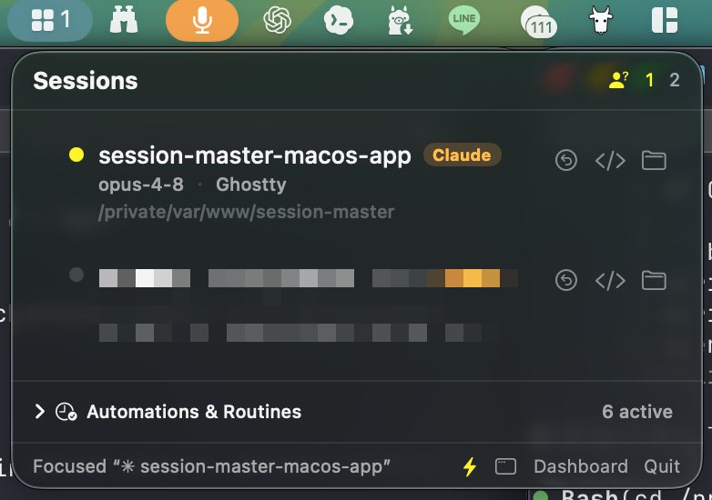

# SessionMaster

**One live menu-bar console for every AI coding session on your Mac** — Claude Code and
Codex, across CLI **and** desktop apps. Stop juggling a dozen terminal windows and app
windows: see every session, know which one needs you, and jump straight to it.

<p align="center">
  
</p>

## Why

If you run several Claude Code / Codex sessions at once — across terminals, the Claude
desktop app, the Codex desktop app, and VS Code — you lose track of:

- which session belongs to which **project / worktree / branch**
- what **model / effort** each is on
- which one is **waiting for you** vs. still working
- *where the actual window is* when you want to get back to it

SessionMaster reads the session state every couple of seconds (all local, read-only) and
puts it in one place, with one-click recall.

## Features

- **Unified, real-time list** of Claude Code (CLI + Desktop) and Codex (CLI + Desktop + VS
  Code) sessions, grouped by project.
- **Status that tells you what each session needs** — your turn, needs approval, working, idle.
- **Parent → child hierarchy**: a Claude session and the Codex companion / sub-agents it
  spawned are nested under it (collapsible).
- **One-click Recall**: raises the exact terminal window that owns a session — and on a
  multi-monitor setup, pulls it onto the display you're looking at.
- **Open in VS Code / Reveal in Finder** — pointed at the session's *real worktree*, not the
  repo root.
- **Routines & Automations** tab: Claude scheduled tasks + Codex automations, with next run.
- **Launch at login**, menu-bar only (no Dock clutter).

### Status colors

| Dot | Meaning |
|----|----|
| 🔴 red | needs your **approval** (a permission prompt is waiting) |
| 🟡 yellow | **your turn** — the assistant finished and is waiting for your input |
| 🟢 green | **working** |
| ⚪ gray | idle / shell / background |

The menu-bar icon shows the count of sessions that need you.

## Install

Requirements: **macOS 14+** and a **Swift 5.9+ / Xcode 15+** toolchain.

```bash
git clone https://github.com/wushan/session-master.git
cd session-master
scripts/install.sh          # builds release, signs, installs to /Applications
open /Applications/SessionMaster.app
```

`install.sh` creates a small **self-signed code-signing identity** in a dedicated keychain
the first time (`scripts/make-dev-cert.sh`). This gives the app a stable signature so the
macOS **Accessibility** grant persists across rebuilds — it is local-only and not sensitive.

On first launch, click the ▦ menu-bar icon → **Dashboard**, and grant **Accessibility** when
prompted (System Settings ▸ Privacy & Security ▸ Accessibility). Recall needs it to focus and
move terminal windows. The in-app banner links you straight there.

### Develop

```bash
scripts/bundle-app.sh       # debug build → build/SessionMaster.app
open build/SessionMaster.app

# Drive the engine (SessionCore) without the GUI:
swift run recall-probe list   # live Claude sessions + owning terminal
swift run recall-probe all    # unified sessions (model / effort / branch / source)
swift run recall-probe tree   # parent → child tree (companions + sub-agents)
swift run recall-probe jobs    # automations + routines with next run
```

## How it works

Everything is read **locally and read-only** — no network, no telemetry.

| Source | Path |
|---|---|
| Claude CLI live status | `~/.claude/sessions/<pid>.json` |
| Claude CLI history (model/branch) | `~/.claude/projects/<encoded-cwd>/<id>.jsonl` |
| Claude Desktop sessions | `~/Library/Application Support/Claude/claude-code-sessions/**/local_*.json` |
| Claude routines | `~/.claude/scheduled-tasks/*/SKILL.md` |
| Codex sessions (CLI/Desktop/VS Code) | `~/.codex/sessions/YYYY/MM/DD/*.jsonl` |
| Codex automations | `~/.codex/automations/*/automation.toml` |

A session is matched to its terminal window by walking the process parent chain
(`sysctl(KERN_PROC_ALL)` → owning terminal app) — process **names are not used**, because the
Claude CLI renames its own process to its version string. Window recall then matches the
Claude session name against the terminal's window title via the **Accessibility API**.

### Architecture

```
SessionCore (library)                 SessionMaster (menu-bar app)
  Collectors  ClaudeLiveCollector       SessionStore     @Observable, 2s poll, off-main
              ClaudeHistoryEnricher      MenuContentView  menu-bar popover
              ClaudeDesktopCollector     MainWindowView   dashboard (tabs/filter/search)
              CodexSessionCollector      SessionNodeView  hierarchy + collapse
              CodexSubagentScanner       AccessibilityBanner / LoginItem
              CodexAutomationCollector
              ClaudeRoutinesCollector
              ProcessCollector           terminal correlation
  Model       UnifiedSession / SessionTree / ScheduledJob
  Actions     Recaller (AX recall + multi-display move) / VSCodeOpener / GitWorktree
  Util        FileCache (mtime-keyed) / JSONLReader / TOMLLite / RRule
```

## Known limitations

- **Cross-Space recall**: a window on another macOS *Space* (virtual desktop) is raised
  (macOS switches to it) but can't be *pulled* to you; only cross-**display** moves are done.
  Doing more would need private SkyLight APIs (SIP off) — out of scope.
- **Codex Desktop**: sessions are read from `~/.codex/sessions` rollouts (works), but its
  open-window UI state lives in an unreadable Chromium store, so recall is best-effort
  (`open -a Codex`).
- Distributed as a **non-sandboxed, self-signed build** (it reads `~/.claude` & `~/.codex`,
  runs `ps`/`git`/AppleScript). It is not notarized and not on the App Store.

## Contributing

Issues and PRs welcome — see [CONTRIBUTING.md](CONTRIBUTING.md). This is a young project; the
collectors target the on-disk formats of current Claude Code / Codex builds, which can change.

## License

[MIT](LICENSE) © 2026 Tony Chiang
